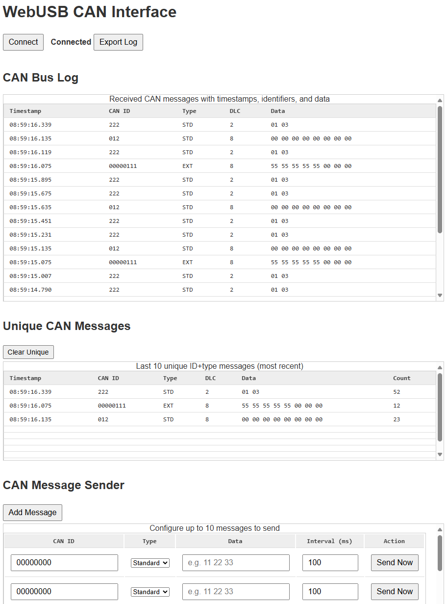

# 🛠 WebUSB CAN Interface Viewer



A lightweight and modern CAN viewer and sender built with **WebUSB** and **STM32 HAL**, communicating via a **Custom HID** USB interface.  
Designed for quick prototyping and testing CAN messages directly from your browser — no external software required.

---

## 📦 Features

- ✅ Send & receive CAN messages from STM32 to the browser
- ✅ Display structured CAN frames in real-time (ID, Type, DLC, Data, Timestamp)
- ✅ Support for both **Standard (11-bit)** and **Extended (29-bit)** CAN IDs
- ✅ Fixed-size USB HID report format for fast USB transfers (64 bytes)
- ✅ Timestamping using PC system clock
- ✅ Auto-scroll with limited message history (20 latest entries)
- ✅ Easy message injection from browser
- ✅ Works directly with Chrome/Edge via WebUSB

---

## 🧰 Project Structure

```
.
├── index.html           # Main frontend UI
├── style.css            # Web styling
├── Images/
│   └── example.png      # Screenshot used in README
├── Core/
│   └── Src/
│       └── main.c       # STM32 HAL CAN + USB logic
└── Drivers/
    └── USB/             # USB middleware with Custom HID
```

---

## 🚀 How to Use

### 💻 PC Side

1. Open `index.html` in Chrome or Edge.
2. Click **"Connect"** and allow access to the STM32 USB device.
3. Messages will start showing up instantly from CAN.
4. Use the **Send** section to transmit data to the microcontroller.

### 📱 Firmware (STM32)

1. Uses CAN2 and USB device (Custom HID)
2. Sends reports in format:
    - `[0..3]` → `CAN ID` (4 bytes, MSB marks EXT)
    - `[4]` → `DLC`
    - `[5..(5+DLC-1)]` → `CAN Data`
3. Listens for IN reports from the PC:
    - Parses `CAN ID + DLC + Data`
    - Transmits over CAN2 immediately

---

## 🧪 HID Report Format

| Byte(s) | Description      |
|---------|------------------|
| 0..3    | CAN ID (w/ MSB = EXT) |
| 4       | DLC (0–8)        |
| 5..12   | CAN Data         |
| 13..63  | Reserved / zero  |

---

## 🛠 Requirements

- STM32 with USB Full-Speed peripheral
- Chrome or Edge browser (WebUSB support)
- ST HAL Libraries (CAN + USB Device)
- `usbd_customhid.c` modified to support IN/OUT endpoints

---

## 📸 Screenshot

See `Images/example.png` for a visual of the UI in action.

---

## 📃 License

This project is licensed under the terms provided by STMicroelectronics and the contributor.  
See `LICENSE` file for full details.

---

## 🤝 Contributing

Found a bug or have an idea? PRs and suggestions are welcome!

---

Made with ❤️ using STM32 + WebUSB
